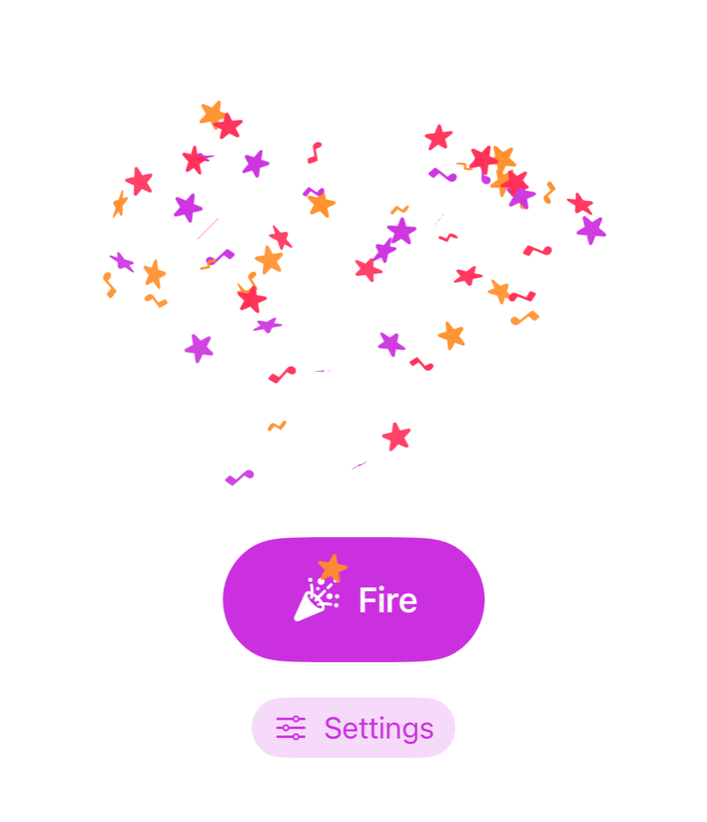

# CoreConfetti

A Core Animation take on [ConfettiSwiftUI](https://github.com/simibac/ConfettiSwiftUI): the same confetti cannon, rebuilt for better performance and more room to customize.


<p align="center">
  
</p>

```swift
Button("Fire") { trigger += 1 }
    .confettiCannon(
        trigger: trigger,
        settings: ConfettiSettings(
            shapes: [.symbol("star.fill"), .symbol("music.note")],
            colors: [.purple, .pink, .orange],
            size: 15,
            repetitions: 3,
            repetitionInterval: 0.25
        )
    )
```

## About

CoreConfetti is based on [ConfettiSwiftUI](https://github.com/simibac/ConfettiSwiftUI) by [Simon Bachmann](https://github.com/simibac). Its goal is to offer a version of ConfettiSwiftUI built on **Core Animation**, with **better performance** and **more flexible customization**.

A burst keeps the look people know from ConfettiSwiftUI: the same shapes, the same throw and fall curves, the same flip and spin, and the same default burst. What changes is how it's drawn, and how much of it you can control.

### Performance

ConfettiSwiftUI builds one SwiftUI view per confetto, starts its animations from main-thread timers, and lets SwiftUI drive every one of them, frame by frame, for the whole burst.

CoreConfetti draws each distinct confetto (a shape, a color, a size) once into a bitmap, and reuses it across every layer. The whole flight is handed to Core Animation up front, so once a burst is in the air, the render server does all the work: the main thread stays free, and your SwiftUI views aren't touched.

### Customization

On top of what ConfettiSwiftUI offers, CoreConfetti adds:

- **A color per shape.** `shapeColors` gives each shape its own palette: red stars and green notes in the same burst.
- **A movable cannon.** `muzzle` fires from anywhere in the view, not only its center. Firing from the top turns a burst into rain.
- **Presets.** `.stars`, `.hearts`, `.celebration`, `.rain`: a finished burst in one word, and a starting point for your own.
- **Settings as a value.** Every option lives in one `ConfettiSettings`, which you can store, reuse and adjust.
- **Any `Equatable` trigger.** Pass a plain value, not a `Binding`.

It also changes a few behaviors:

- **Reduce Motion is respected.** When the system setting is on, a burst becomes a still scatter that fades in and out. ConfettiSwiftUI ignores the setting.
- **Confetti never get in the way.** They don't intercept touches, and VoiceOver doesn't see them. ConfettiSwiftUI doesn't exclude them from either.
- **Your layout is left alone.** The cannon is an overlay and never changes the size of the view it's attached to. ConfettiSwiftUI wraps your view in a `ZStack`.
- **Haptics are opt-in.** They're off by default, where ConfettiSwiftUI turns them on.

### What ConfettiSwiftUI does that CoreConfetti doesn't

CoreConfetti is built on UIKit and Core Animation, which comes at a cost. ConfettiSwiftUI is the better choice if you need:

- **macOS, tvOS or watchOS.** ConfettiSwiftUI runs on iOS, macOS, tvOS and watchOS. CoreConfetti runs on iOS and visionOS only.
- **iOS 14 or 15.** ConfettiSwiftUI supports iOS 14 and later. CoreConfetti requires iOS 16.
- **Images from your asset catalog** as confetti. CoreConfetti supports SF Symbols, paper shapes and text/emoji, but not asset images yet.

## Requirements

- iOS 16+ or visionOS 1+
- Swift 6 / Xcode 16+

CoreConfetti is built on UIKit, so it does **not** support macOS, watchOS or tvOS.

## Installation

In Xcode, choose **File → Add Package Dependencies…** and enter:

```
https://github.com/CardinalJV/CoreConfetti.git
```

Or add it to your `Package.swift`:

```swift
dependencies: [
    .package(url: "https://github.com/CardinalJV/CoreConfetti.git", from: "1.0.0")
]
```

and add `"CoreConfetti"` to your target's dependencies.

## Usage

Attach `.confettiCannon(trigger:settings:)` to any view. The cannon fires every time `trigger` changes, so a counter is all you need:

```swift
import SwiftUI
import CoreConfetti

struct ContentView: View {
    @State private var trigger = 0

    var body: some View {
        Button("Celebrate") {
            trigger += 1
        }
        .confettiCannon(trigger: trigger)
    }
}
```

`trigger` can be any `Equatable` value. The cannon doesn't fire when the view first appears, only when the value changes.

### Presets

| Preset | What it throws |
|---|---|
| `.paper` | The classic paper burst. This is the default. |
| `.stars` | Gold stars and sparkles. |
| `.hearts` | Pink, red and purple hearts. |
| `.celebration` | Three bursts of paper, a quarter-second apart. |
| `.rain` | Confetti falling from the top of the view. Attach it to something that fills the screen. |

```swift
.confettiCannon(trigger: trigger, settings: .hearts)
```

Presets are plain values, so you can start from one and adjust it:

```swift
var settings = ConfettiSettings.stars
settings.count = 50
settings.hapticFeedback = true
```

### Custom bursts

Every setting has a default, so you only name what you change:

```swift
.confettiCannon(
    trigger: trigger,
    settings: ConfettiSettings(
        count: 40,
        shapes: [.symbol("music.note"), .symbol("star.fill"), .circle],
        colors: [.purple, .pink, .orange],
        size: 15,
        repetitions: 3,
        repetitionInterval: 0.25
    )
)
```

### Shapes

| Shape | |
|---|---|
| `.circle`, `.square`, `.triangle`, `.slimRectangle`, `.roundedCross` | Paper shapes. `ConfettiShape.paper` lists all five. |
| `.symbol("heart.fill")` | Any SF Symbol, by name, drawn in the confetto's color. |
| `.text("🎉")` | A short string, usually one emoji. Emoji keep their own colors. |

If a symbol name doesn't exist on the device, the confetto falls back to a circle. In debug builds, an assertion names the missing symbol, so a typo can't go unnoticed.

### One color per shape

By default, every confetto picks a random color from `colors`. `shapeColors` gives a shape its own palette:

```swift
ConfettiSettings(
    shapes: [.symbol("star.fill"), .symbol("music.note")],
    colors: [.purple, .pink],
    shapeColors: [
        .symbol("star.fill"): [.red],
        .symbol("music.note"): [.green]
    ]
)
```

Here the stars are always red and the notes always green. Shapes without an entry fall back to `colors`.

### Firing from somewhere else

The cannon fires from the center of its view. `muzzle` moves it anywhere in the view's bounds, and the cone sets the direction:

```swift
Color.clear
    .ignoresSafeArea()
    .confettiCannon(
        trigger: trigger,
        settings: ConfettiSettings(
            muzzle: .top,
            openingAngle: .degrees(0),
            closingAngle: .degrees(180),
            rainHeight: 1200
        )
    )
```

Angles are measured counter-clockwise from the right: `60°` to `120°`, the default, is a cone pointing straight up.

## Settings

| Setting | Default | |
|---|---|---|
| `count` | `20` | Confetti per burst. |
| `shapes` | `ConfettiShape.paper` | What the confetti are drawn as. |
| `colors` | seven colors | The palette confetti pick from. |
| `shapeColors` | `[:]` | Per-shape palettes that override `colors`. |
| `size` | `10` | Side length for paper shapes, point size for symbols and text. |
| `opacity` | `1` | Opacity at the top of the throw. |
| `muzzle` | `.center` | Where in the view the cannon sits. |
| `openingAngle`, `closingAngle` | `60°`, `120°` | The cone the burst is thrown into. |
| `radius` | `300` | How far the throw carries a confetto. |
| `rainHeight` | `600` | How far a confetto falls after the throw. |
| `fadesOut` | `true` | Whether confetti fade out as they land. |
| `repetitions` | `1` | Bursts per trigger. |
| `repetitionInterval` | `1` | Seconds between bursts. |
| `hapticFeedback` | `false` | One haptic tap per burst. Off by default. |
| `respectsReduceMotion` | `true` | Honors the system's Reduce Motion setting. |

## Accessibility

When **Reduce Motion** is on, a burst doesn't fly: each confetto appears where the throw would have taken it, fades in, and fades out. You keep the same spread and colors, with no movement.

Leave `respectsReduceMotion` on unless the confetti are the content itself rather than decoration. Confetti are also hidden from VoiceOver and never intercept touches.

## Demo app

Open `Example/CoreConfettiDemo.xcodeproj` to try the cannon. The demo lets you change the confetti count, the number of bursts, the colors, and the SF Symbols, including a color per symbol.

## Running the tests

The package depends on UIKit, so `swift test` (which builds for macOS) won't work. Run the tests on an iOS simulator:

```bash
xcodebuild test -scheme CoreConfetti -destination 'platform=iOS Simulator,name=iPhone 17'
```

## Credits

CoreConfetti is based on **[ConfettiSwiftUI](https://github.com/simibac/ConfettiSwiftUI)**, created by **Simon Bachmann** ([@simibac](https://github.com/simibac)) and released under the MIT license.

The paper shapes, the physics of a burst (the throw and fall curves, the cone, the spread, the flip and spin speeds) and the default settings all come from ConfettiSwiftUI. CoreConfetti redraws them with Core Animation and adds the options listed above.

If you need macOS, tvOS, watchOS, iOS 14–15 or images from your asset catalog, [ConfettiSwiftUI](https://github.com/simibac/ConfettiSwiftUI) is the right choice.

## License

CoreConfetti is available under the MIT license. See [LICENSE](LICENSE) for details.

ConfettiSwiftUI's copyright and license notice is reproduced in [THIRD_PARTY_NOTICES.md](THIRD_PARTY_NOTICES.md).
